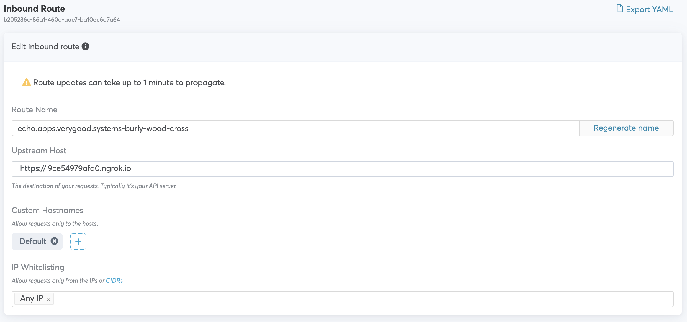
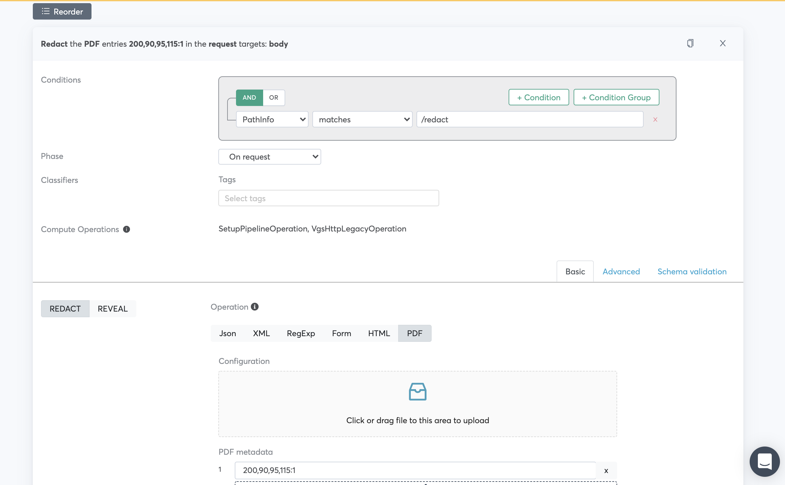
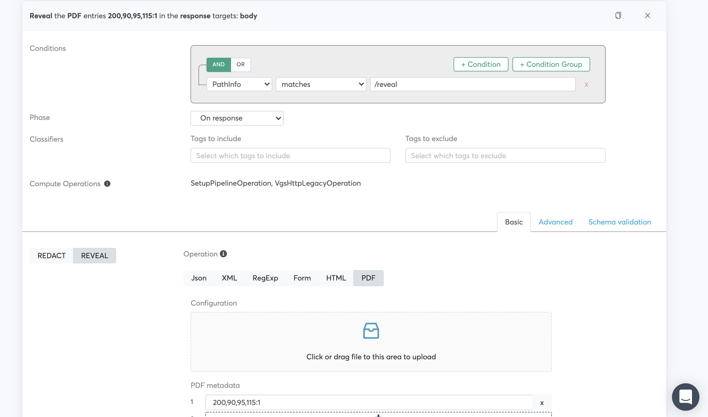
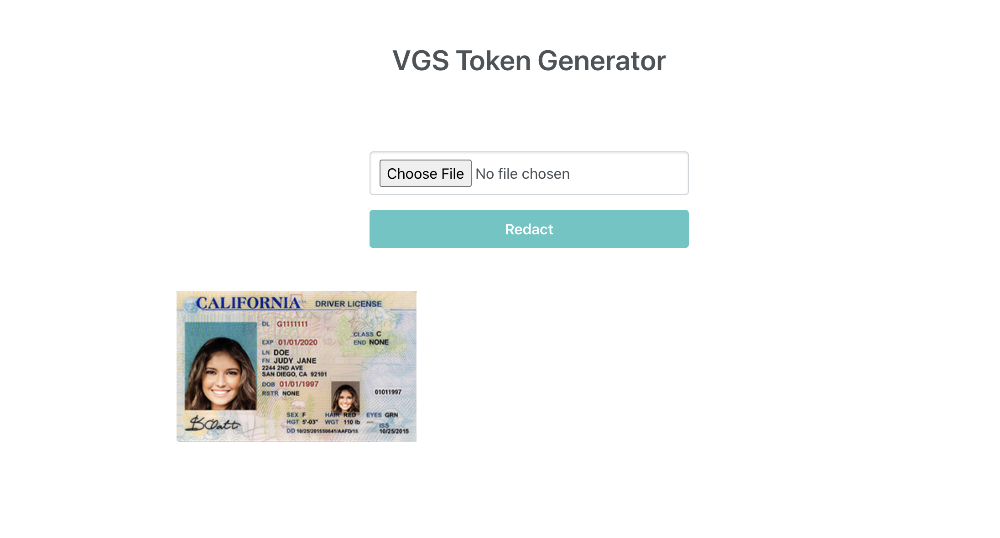
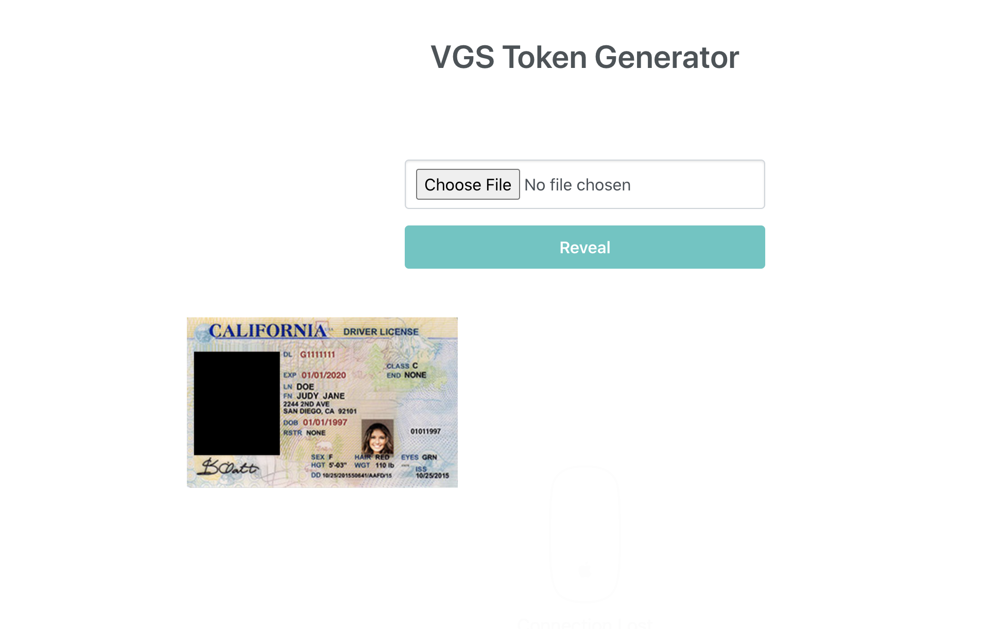

# PDF Masking Demo

<p align="center"><a href="https://www.verygoodsecurity.com/"></a></p>
<p align="center"><b>Using VGS to Mask Data from PDFs</b></p>

This application demonstrates how VGS can allow your API consumers to send you PDF files containing sensitive data without your systems being exposed to it. The proxy can redact the parts of the file that contain sensitive data, store them in the secure VGS vault, and send your systems the PDF file with those parts blacked out. If you need to send the whole, unredacted PDF somewhere, the proxy can intercept the HTTP request or response coming out of your system, and fill the redacted parts of the file back in. 

The application allows users to submit PDF files to the server, verify that the PDF the server received is partially redact, and, upon request, view the original file. The server exposes two endpoints, ```/redact``` and ```/reveal.``` Both accept a PDF file and respond with an identical one. These endpoints differ only in how we configure VGS to treat them. We create an inbound route that redacts data in requests to the ```/redact``` endpoint, and reveals it in responses to the ```/reveal``` endpoint. The front end is a simple React application. The user can upload a PDF for the application to hold in memory. Clicking "Redact" sends the uploaded file to the ```/redact``` endpoint. The application displays the PDF returned from the server, which is the redacted file. Clicking "Reveal" now sends the uploaded file to the ```/reveal``` endpoint, and the application will display the unredacted PDF that endpoint returns. 

# Running the Application

* Edit ```docker_compose.yaml```, and replace YOUR_VGS_VAULT_ID with your VGS vault ID.
* In your terminal, run ```docker-compose up -d --force-recreate```
* Next, run ```ngrok http 5000```

## VGS Dashboard Configuration
Set your route's upsteam host to your nGrok URL:


Add two filters:

One to mask the desired part of PDFs sent to the redact route


One to reveal that part in PDFs sent to the reveal route


Note that the coordinates specified in the routes consist of four digitis - x coordinate of the bottom left corner, y coordinate of the bottom left corner, width, and height respectively. The coordinates in the examples will mask the photo from the example driver's license image provided in this repository.


For a quick start, you can use the config.yaml in this project to import a sample route. Using [vgs-cli](https://www.verygoodsecurity.com/docs/cli), run
```vgs --tenant=VAULT_ID route --sync-all < config.yaml```

### Try it out

Note: This app is intended to demonstrate VGS's capabilities and is not intended to securely handle live data. Do not input any PDFs containing real sensitive data.

Open http://0.0.0.0:3000/ in your browser, and upload a PDF of your choice


Click "Redact" and observe the result with the redaction


Click "Reveal" and observe how the original PDF is displayed again


